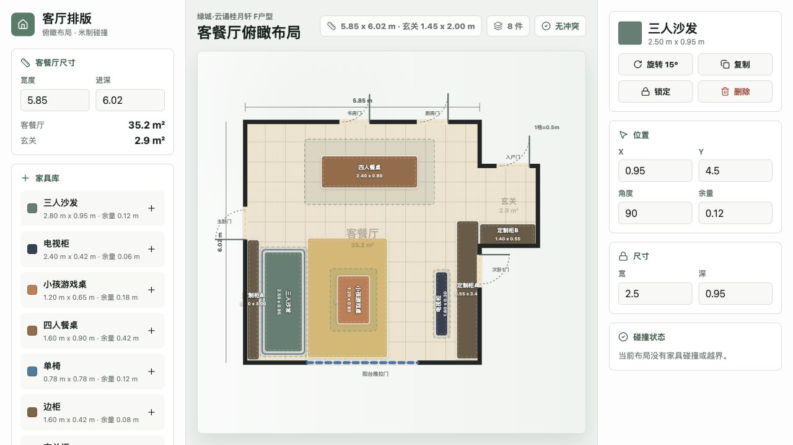

# 在线家庭软装布置预览

一个面向户型软装推敲的 Web 小工具。当前版本聚焦客餐厅俯瞰视角，用米制网格表达家具尺寸、通道余量、门洞和玄关空间，并支持家具碰撞体积检查。



## 功能

- 俯瞰式客餐厅布局画布，内置当前 F 户型客餐厅、玄关、阳台和主要房门示意。
- 家具支持拖拽、旋转、复制、删除和尺寸微调。
- 家具碰撞体积按实际尺寸加外扩余量计算，可提示家具互相重叠或越过户型边界。
- 地毯等软装可设置为可叠放，不参与碰撞。
- 定制柜等固定项可锁定，避免误拖动。
- 布局状态保存到本地 Node 服务端的 JSON 文件，刷新页面后继续恢复。

## 技术栈

- React + TypeScript
- Vite
- SVG 俯瞰画布
- Node.js 内置 HTTP 服务

## 本地运行

```bash
npm install
npm run dev
```

默认访问：

```text
http://localhost:5188/
```

如需换端口：

```bash
PORT=5190 npm run dev
```

## 构建

```bash
npm run build
npm run preview
```

## 状态保存

服务端会把当前布局写入：

```text
server-data/layout-state.json
```

这个文件属于运行时数据，默认不会提交到 git。删除该文件后，应用会回到源码里的初始布局。

## 目录

```text
src/
  components/        UI 和 SVG 画布组件
  data.ts            户型、家具模板和初始布局数据
  geometry.ts        碰撞检测、旋转盒和户型边界计算
server.mjs           前端开发服务和布局状态 API
public/              静态资源
docs/screenshots/    README 截图
```

## 许可

MIT
